# System Architecture Diagram


# Merchant Flow Diagram

```mermaid
flowchart TD
    %% Entry Points
    START[Merchant logs into Shopify Admin] --> DASH[Returns Dashboard]
    
    %% Main Dashboard
    DASH --> |View Overview| ANALYTICS[Returns Analytics Dashboard<br/>• Total returns this month<br/>• Return rate trends<br/>• Top returned products<br/>• Customer flags & alerts]
    
    %% Dashboard Actions
    ANALYTICS --> |Review Alerts| FLAGS{AI Flags & Alerts}
    ANALYTICS --> |Manage Returns| PENDING[View Pending Returns]
    ANALYTICS --> |View Reports| REPORTS[Detailed Reports]
    ANALYTICS --> |Configure Rules| CONFIG[AI Rules Configuration]
    
    %% AI Flags & Alerts
    FLAGS --> |High Return Customer| CUSTOMER_FLAG[Customer: 30%+ return rate<br/>• View customer history<br/>• Apply restrictions<br/>• Send personalized message]
    FLAGS --> |Product Issue| PRODUCT_FLAG[Product Alert<br/>• High return rate detected<br/>• View return reasons<br/>• Contact supplier<br/>• Update listing]
    FLAGS --> |Fraud Detection| FRAUD_FLAG[Potential Fraud<br/>• Suspicious return patterns<br/>• Block future returns<br/>• Review account]
    
    %% Return Management Flow
    PENDING --> RETURN_ITEM[Individual Return Request<br/>Order #12345<br/>Product: iPhone Case<br/>Reason: Defective<br/>Photos: Available]
    
    RETURN_ITEM --> DECISION{Review Return}
    DECISION --> |Approve| APPROVE[Approve Return<br/>• Generate return label<br/>• Send customer notification<br/>• Schedule refund]
    DECISION --> |Deny| DENY[Deny Return<br/>• Select reason<br/>• Send explanation<br/>• Suggest alternatives]
    DECISION --> |Request Info| REQUEST[Request More Info<br/>• Ask for photos<br/>• Clarify issue<br/>• Set follow-up reminder]
    
    %% Post-Decision Actions
    APPROVE --> REFUND_OPTS[Refund Options<br/>• Full refund<br/>• Partial refund<br/>• Store credit<br/>• Exchange]
    DENY --> ARCHIVE_DENY[Archive as Denied]
    REQUEST --> FOLLOW_UP[Set Follow-up Alert]
    
    %% AI Suggestions
    RETURN_ITEM --> AI_SUGGEST[AI Recommendations<br/>• Suggested action based on history<br/>• Similar case outcomes<br/>• Fraud risk score<br/>• Customer value assessment]
    
    %% Reports & Analytics
    REPORTS --> TREND_ANALYSIS[Trend Analysis<br/>• Return patterns over time<br/>• Seasonal variations<br/>• Product performance<br/>• Cost impact analysis]
    
    REPORTS --> CUSTOMER_INSIGHTS[Customer Insights<br/>• Repeat returners<br/>• High-value customers<br/>• Geographic patterns<br/>• Behavior segmentation]
    
    %% Configuration
    CONFIG --> RULES_SETUP[Configure AI Rules<br/>• Set return rate thresholds<br/>• Define fraud indicators<br/>• Approval workflows<br/>• Notification preferences]
    
    CONFIG --> AUTOMATION[Automation Settings<br/>• Auto-approve low-risk returns<br/>• Auto-flag suspicious patterns<br/>• Scheduled report delivery<br/>• Integration preferences]
    
    %% Bulk Actions
    PENDING --> BULK[Bulk Actions<br/>• Select multiple returns<br/>• Approve all low-risk<br/>• Deny policy violations<br/>• Export for review]
    
    %% Quick Actions from Dashboard
    ANALYTICS --> QUICK[Quick Actions<br/>• Block problematic customer<br/>• Update return policy<br/>• Contact customer directly<br/>• Escalate to support team]
    
    %% Styling
    classDef entry fill:#e9ffe0,stroke:#85de91,stroke-width:2px
    classDef dashboard fill:#c2ffca,stroke:#059212,stroke-width:2px
    classDef analytics fill:#fef3c7,stroke:#f59e0b,stroke-width:2px
    classDef decision fill:white,stroke:#58bfaf,stroke-width:2px
    classDef action fill:#fdffe0,stroke:#d7db95,stroke-width:2px
    classDef ai fill:#e0e7ff,stroke:#6366f1,stroke-width:2px
    classDef config fill:#e3fafa,stroke:#57d4d4,stroke-width:2px
    
    class START entry
    class DASH,ANALYTICS dashboard
    class FLAGS,CUSTOMER_FLAG,PRODUCT_FLAG,FRAUD_FLAG analytics
    class DECISION decision
    class APPROVE,DENY,REQUEST,REFUND_OPTS,BULK,QUICK action
    class AI_SUGGEST,RULES_SETUP,AUTOMATION ai
    class CONFIG,REPORTS config
```




# Client Flow Diagram

```mermaid
flowchart TD
    %% Entry Points
    START[Customer has product issue] --> ENTRY_POINT{How does customer reach us?}
    
    ENTRY_POINT --> |Order email link| EMAIL_LINK[Click Return/Exchange in order email]
    ENTRY_POINT --> |Store website| WEBSITE[Visit store website<br/>Go to Returns page]
    ENTRY_POINT --> |Account dashboard| ACCOUNT[Login to customer account<br/>View order history]
    
    %% Initial Issue Identification
    EMAIL_LINK --> ISSUE_SELECT
    WEBSITE --> ISSUE_SELECT
    ACCOUNT --> ISSUE_SELECT[Select Your Issue<br/>• Product not working<br/>• Wrong item received<br/>• Damaged in shipping<br/>• Changed mind<br/>• Size/fit issues]
    
    %% AI Triage Decision Point
    ISSUE_SELECT --> AI_TRIAGE{AI Determines<br/>Issue Type}
    
    %% Troubleshooting Path (Electronics Focus)
    AI_TRIAGE --> |Technical Issue Detected| TROUBLESHOOT[AI Troubleshooting Assistant<br/>Hi! I can help fix this issue.<br/>Let's try a few quick solutions first.]
    
    TROUBLESHOOT --> DEVICE_INFO[What device are you using?<br/>• Phone model & OS<br/>• Headphones/speakers<br/>• Laptop/computer<br/>• Other electronics]
    
    DEVICE_INFO --> PROBLEM_DETAILS[Describe the specific problem:<br/>• Not turning on<br/>• Connection issues<br/>• Performance problems<br/>• Display issues<br/>• Audio problems]
    
    PROBLEM_DETAILS --> AI_SOLUTIONS[AI Suggests Solutions<br/>• Step-by-step troubleshooting<br/>• Video tutorials<br/>• Compatibility checks<br/>• Settings adjustments]
    
    AI_SOLUTIONS --> SOLUTION_RESULT{Did this solve your issue?}
    
    SOLUTION_RESULT --> |Yes - Problem Solved| RESOLVED[Issue Resolved! 🎉<br/>• Glad we could help!<br/>• Ask for feedback<br/>• Offer support contact<br/>• No return needed]
    
    SOLUTION_RESULT --> |Partially Fixed| ADDITIONAL[Try Additional Solutions<br/>• More advanced troubleshooting<br/>• Firmware updates<br/>• Reset procedures<br/>• Contact tech support]
    
    SOLUTION_RESULT --> |No - Still Broken| PROCEED_RETURN[Proceed with Return<br/>Sorry this didn't work.<br/>Let's get you a replacement.]
    
    %% Direct Return Path
    AI_TRIAGE --> |Non-technical Issue| RETURN_REASON[Select Return Reason<br/>• Wrong size/color<br/>• Doesn't match description<br/>• Damaged on arrival<br/>• Changed mind<br/>• Found better price elsewhere]
    
    %% Return Process Flow
    PROCEED_RETURN --> RETURN_DETAILS
    RETURN_REASON --> RETURN_DETAILS[Return Details<br/>• Upload photos if damaged<br/>• Describe condition<br/>• Preferred resolution<br/>• Original packaging available?]
    
    RETURN_DETAILS --> RETURN_OPTIONS[Choose Return Option<br/>• Full refund<br/>• Exchange for same item<br/>• Exchange for different size/color<br/>• Store credit]
    
    RETURN_OPTIONS --> RETURN_METHOD[Return Method<br/>• Drop off at store<br/>• Schedule pickup<br/>• Mail with prepaid label<br/>• Print return label]
    
    RETURN_METHOD --> CONFIRMATION[Return Confirmation<br/>• Return request RET-12345<br/>• Email with instructions<br/>• Tracking information<br/>• Expected timeline<br/>• Contact info if needed]
    
    %% Follow-up Flow
    CONFIRMATION --> PACKAGE_RETURN[Customer Returns Package]
    PACKAGE_RETURN --> TRACKING[Track Return Status<br/>• Package in transit<br/>• Received by merchant<br/>• Being processed<br/>• Refund/exchange complete]
    
    %% AI Learning & Prevention
    RESOLVED --> FEEDBACK[Quick Feedback<br/>• Rate the help 1-5 stars<br/>• What worked best?<br/>• Suggest improvements]
    
    PROCEED_RETURN --> PREVENTION[AI Notes for Prevention<br/>• Common issue flagged<br/>• Product improvement suggestion<br/>• Better product descriptions needed]
    
    %% Alternative Paths
    AI_TRIAGE --> |Policy Question| POLICY_HELP[Policy Assistant<br/>• Return time limits<br/>• Condition requirements<br/>• Refund vs exchange<br/>• Shipping costs<br/>• Special circumstances]
    
    ADDITIONAL --> EXPERT_HELP[Connect with Expert<br/>• Live chat with tech support<br/>• Schedule phone call<br/>• Video troubleshooting<br/>• Advanced diagnostics]
    
    %% Customer Support Integration
    EXPERT_HELP --> SUPPORT_OUTCOME{Support Outcome}
    SUPPORT_OUTCOME --> |Issue Fixed| RESOLVED
    SUPPORT_OUTCOME --> |Still Need Return| PROCEED_RETURN
    
    %% Policy Help Flow
    POLICY_HELP --> POLICY_RESOLVED{Policy Question Resolved?}
    POLICY_RESOLVED --> |Yes| END_HELP[Customer has clarity<br/>Continues with return/keeps item]
    POLICY_RESOLVED --> |No| HUMAN_SUPPORT[Connect with<br/>Human Support Agent]
    HUMAN_SUPPORT --> END_HELP
    
    %% Proactive Prevention (Future Feature)
    START --> |Optional| PROACTIVE[Proactive AI Check<br/>Before returning, let me<br/>check if this is fixable]
    PROACTIVE --> ISSUE_SELECT
    
    %% Final outcomes
    TRACKING --> PROCESS_COMPLETE[Return Process Complete<br/>• Customer satisfaction survey<br/>• Future purchase incentives<br/>• AI improvement data captured]
    
    FEEDBACK --> IMPROVEMENT[Continuous Improvement<br/>• Update troubleshooting database<br/>• Refine AI suggestions<br/>• Product team notifications]
    
    PREVENTION --> IMPROVEMENT
    
    %% Styling
    classDef entry fill:#95f985,stroke:#059212,stroke-width:2px
    classDef ai fill:#e0e7ff,stroke:#6366f1,stroke-width:2px
    classDef troubleshoot fill:#fef3c7,stroke:#f59e0b,stroke-width:2px
    classDef decision fill:#fed7e2,stroke:#f687b3,stroke-width:2px
    classDef success fill:#dcfce7,stroke:#16a34a,stroke-width:2px
    classDef process fill:#dbeafe,stroke:#3b82f6,stroke-width:2px
    classDef support fill:#f3e8ff,stroke:#8b5cf6,stroke-width:2px
    classDef outcome fill:#f0f9ff,stroke:#0ea5e9,stroke-width:2px
    
    class START,ENTRY_POINT entry
    class AI_TRIAGE,TROUBLESHOOT,AI_SOLUTIONS,POLICY_HELP,PROACTIVE ai
    class DEVICE_INFO,PROBLEM_DETAILS,ADDITIONAL troubleshoot
    class SOLUTION_RESULT,SUPPORT_OUTCOME,POLICY_RESOLVED decision
    class RESOLVED,CONFIRMATION success
    class RETURN_DETAILS,RETURN_OPTIONS,RETURN_METHOD,TRACKING process
    class EXPERT_HELP,FEEDBACK,HUMAN_SUPPORT support
    class PROCESS_COMPLETE,END_HELP,IMPROVEMENT outcome
```




# Shopify App Template - Remix

This is a template for building a [Shopify app](https://shopify.dev/docs/apps/getting-started) using the [Remix](https://remix.run) framework.

Rather than cloning this repo, you can use your preferred package manager and the Shopify CLI with [these steps](https://shopify.dev/docs/apps/getting-started/create).

Visit the [`shopify.dev` documentation](https://shopify.dev/docs/api/shopify-app-remix) for more details on the Remix app package.

## Quick start

### Prerequisites

Before you begin, you'll need the following:

1. **Node.js**: [Download and install](https://nodejs.org/en/download/) it if you haven't already.
2. **Shopify Partner Account**: [Create an account](https://partners.shopify.com/signup) if you don't have one.
3. **Test Store**: Set up either a [development store](https://help.shopify.com/en/partners/dashboard/development-stores#create-a-development-store) or a [Shopify Plus sandbox store](https://help.shopify.com/en/partners/dashboard/managing-stores/plus-sandbox-store) for testing your app.

### Setup

If you used the CLI to create the template, you can skip this section.

Using yarn:

```shell
yarn install
```

Using npm:

```shell
npm install
```

Using pnpm:

```shell
pnpm install
```

### Local Development

Using yarn:

```shell
yarn dev
```

Using npm:

```shell
npm run dev
```

Using pnpm:

```shell
pnpm run dev
```

Press P to open the URL to your app. Once you click install, you can start development.

Local development is powered by [the Shopify CLI](https://shopify.dev/docs/apps/tools/cli). It logs into your partners account, connects to an app, provides environment variables, updates remote config, creates a tunnel and provides commands to generate extensions.

### Authenticating and querying data

To authenticate and query data you can use the `shopify` const that is exported from `/app/shopify.server.js`:

```js
export async function loader({ request }) {
  const { admin } = await shopify.authenticate.admin(request);

  const response = await admin.graphql(`
    {
      products(first: 25) {
        nodes {
          title
          description
        }
      }
    }`);

  const {
    data: {
      products: { nodes },
    },
  } = await response.json();

  return nodes;
}
```

This template comes preconfigured with examples of:

1. Setting up your Shopify app in [/app/shopify.server.ts](https://github.com/Shopify/shopify-app-template-remix/blob/main/app/shopify.server.ts)
2. Querying data using Graphql. Please see: [/app/routes/app.\_index.tsx](https://github.com/Shopify/shopify-app-template-remix/blob/main/app/routes/app._index.tsx).
3. Responding to webhooks in individual files such as [/app/routes/webhooks.app.uninstalled.tsx](https://github.com/Shopify/shopify-app-template-remix/blob/main/app/routes/webhooks.app.uninstalled.tsx) and [/app/routes/webhooks.app.scopes_update.tsx](https://github.com/Shopify/shopify-app-template-remix/blob/main/app/routes/webhooks.app.scopes_update.tsx)

Please read the [documentation for @shopify/shopify-app-remix](https://www.npmjs.com/package/@shopify/shopify-app-remix#authenticating-admin-requests) to understand what other API's are available.

## Deployment

### Application Storage

This template uses [Prisma](https://www.prisma.io/) to store session data, by default using an [SQLite](https://www.sqlite.org/index.html) database.
The database is defined as a Prisma schema in `prisma/schema.prisma`.

This use of SQLite works in production if your app runs as a single instance.
The database that works best for you depends on the data your app needs and how it is queried.
You can run your database of choice on a server yourself or host it with a SaaS company.
Here's a short list of databases providers that provide a free tier to get started:

| Database   | Type             | Hosters                                                                                                                                                                                                                               |
| ---------- | ---------------- | ------------------------------------------------------------------------------------------------------------------------------------------------------------------------------------------------------------------------------------- |
| MySQL      | SQL              | [Digital Ocean](https://www.digitalocean.com/products/managed-databases-mysql), [Planet Scale](https://planetscale.com/), [Amazon Aurora](https://aws.amazon.com/rds/aurora/), [Google Cloud SQL](https://cloud.google.com/sql/docs/mysql) |
| PostgreSQL | SQL              | [Digital Ocean](https://www.digitalocean.com/products/managed-databases-postgresql), [Amazon Aurora](https://aws.amazon.com/rds/aurora/), [Google Cloud SQL](https://cloud.google.com/sql/docs/postgres)                                   |
| Redis      | Key-value        | [Digital Ocean](https://www.digitalocean.com/products/managed-databases-redis), [Amazon MemoryDB](https://aws.amazon.com/memorydb/)                                                                                                        |
| MongoDB    | NoSQL / Document | [Digital Ocean](https://www.digitalocean.com/products/managed-databases-mongodb), [MongoDB Atlas](https://www.mongodb.com/atlas/database)                                                                                                  |

To use one of these, you can use a different [datasource provider](https://www.prisma.io/docs/reference/api-reference/prisma-schema-reference#datasource) in your `schema.prisma` file, or a different [SessionStorage adapter package](https://github.com/Shopify/shopify-api-js/blob/main/packages/shopify-api/docs/guides/session-storage.md).

### Build

Remix handles building the app for you, by running the command below with the package manager of your choice:

Using yarn:

```shell
yarn build
```

Using npm:

```shell
npm run build
```

Using pnpm:

```shell
pnpm run build
```

## Hosting

When you're ready to set up your app in production, you can follow [our deployment documentation](https://shopify.dev/docs/apps/deployment/web) to host your app on a cloud provider like [Heroku](https://www.heroku.com/) or [Fly.io](https://fly.io/).

When you reach the step for [setting up environment variables](https://shopify.dev/docs/apps/deployment/web#set-env-vars), you also need to set the variable `NODE_ENV=production`.

### Hosting on Vercel

Using the Vercel Preset is recommended when hosting your Shopify Remix app on Vercel. You'll also want to ensure imports that would normally come from `@remix-run/node` are imported from `@vercel/remix` instead. Learn more about hosting Remix apps on Vercel [here](https://vercel.com/docs/frameworks/remix).

```diff
// vite.config.ts
import { vitePlugin as remix } from "@remix-run/dev";
import { defineConfig, type UserConfig } from "vite";
import tsconfigPaths from "vite-tsconfig-paths";
+ import { vercelPreset } from '@vercel/remix/vite';

installGlobals();

export default defineConfig({
  plugins: [
    remix({
      ignoredRouteFiles: ["**/.*"],
+     presets: [vercelPreset()],
    }),
    tsconfigPaths(),
  ],
});
```

## Troubleshooting

### Database tables don't exist

If you get this error:

```
The table `main.Session` does not exist in the current database.
```

You need to create the database for Prisma. Run the `setup` script in `package.json` using your preferred package manager.

### Navigating/redirecting breaks an embedded app

Embedded Shopify apps must maintain the user session, which can be tricky inside an iFrame. To avoid issues:

1. Use `Link` from `@remix-run/react` or `@shopify/polaris`. Do not use `<a>`.
2. Use the `redirect` helper returned from `authenticate.admin`. Do not use `redirect` from `@remix-run/node`
3. Use `useSubmit` or `<Form/>` from `@remix-run/react`. Do not use a lowercase `<form/>`.

This only applies if your app is embedded, which it will be by default.

### Non Embedded

Shopify apps are best when they are embedded in the Shopify Admin, which is how this template is configured. If you have a reason to not embed your app please make the following changes:

1. Ensure `embedded = false` is set in [shopify.app.toml`](./shopify.app.toml). [Docs here](https://shopify.dev/docs/apps/build/cli-for-apps/app-configuration#global).
2. Pass `isEmbeddedApp: false` to `shopifyApp()` in `./app/shopify.server.js|ts`.
3. Change the `isEmbeddedApp` prop to `isEmbeddedApp={false}` for the `AppProvider` in `/app/routes/app.jsx|tsx`.
4. Remove the `@shopify/app-bridge-react` dependency from [package.json](./package.json) and `vite.config.ts|js`.
5. Remove anything imported from `@shopify/app-bridge-react`.  For example: `NavMenu`, `TitleBar` and `useAppBridge`.

### OAuth goes into a loop when I change my app's scopes

If you change your app's scopes and authentication goes into a loop and fails with a message from Shopify that it tried too many times, you might have forgotten to update your scopes with Shopify.
To do that, you can run the `deploy` CLI command.

Using yarn:

```shell
yarn deploy
```

Using npm:

```shell
npm run deploy
```

Using pnpm:

```shell
pnpm run deploy
```

### My shop-specific webhook subscriptions aren't updated

If you are registering webhooks in the `afterAuth` hook, using `shopify.registerWebhooks`, you may find that your subscriptions aren't being updated.  

Instead of using the `afterAuth` hook, the recommended approach is to declare app-specific webhooks in the `shopify.app.toml` file.  This approach is easier since Shopify will automatically update changes to webhook subscriptions every time you run `deploy` (e.g: `npm run deploy`).  Please read these guides to understand more:

1. [app-specific vs shop-specific webhooks](https://shopify.dev/docs/apps/build/webhooks/subscribe#app-specific-subscriptions)
2. [Create a subscription tutorial](https://shopify.dev/docs/apps/build/webhooks/subscribe/get-started?framework=remix&deliveryMethod=https)

If you do need shop-specific webhooks, please keep in mind that the package calls `afterAuth` in 2 scenarios:

- After installing the app
- When an access token expires

During normal development, the app won't need to re-authenticate most of the time, so shop-specific subscriptions aren't updated. To force your app to update the subscriptions, you can uninstall and reinstall it in your development store. That will force the OAuth process and call the `afterAuth` hook.

### Admin created webhook failing HMAC validation

Webhooks subscriptions created in the [Shopify admin](https://help.shopify.com/en/manual/orders/notifications/webhooks) will fail HMAC validation. This is because the webhook payload is not signed with your app's secret key.  There are 2 solutions:

1. Use [app-specific webhooks](https://shopify.dev/docs/apps/build/webhooks/subscribe#app-specific-subscriptions) defined in your toml file instead (recommended)
2. Create [webhook subscriptions](https://shopify.dev/docs/api/shopify-app-remix/v1/guide-webhooks) using the `shopifyApp` object.

Test your webhooks with the [Shopify CLI](https://shopify.dev/docs/apps/tools/cli/commands#webhook-trigger) or by triggering events manually in the Shopify admin(e.g. Updating the product title to trigger a `PRODUCTS_UPDATE`).

### Incorrect GraphQL Hints

By default the [graphql.vscode-graphql](https://marketplace.visualstudio.com/items?itemName=GraphQL.vscode-graphql) extension for VS Code will assume that GraphQL queries or mutations are for the [Shopify Admin API](https://shopify.dev/docs/api/admin). This is a sensible default, but it may not be true if:

1. You use another Shopify API such as the storefront API.
2. You use a third party GraphQL API.

in this situation, please update the [.graphqlrc.ts](https://github.com/Shopify/shopify-app-template-remix/blob/main/.graphqlrc.ts) config.

### First parameter has member 'readable' that is not a ReadableStream.

See [hosting on Vercel](#hosting-on-vercel).

### Admin object undefined on webhook events triggered by the CLI

When you trigger a webhook event using the Shopify CLI, the `admin` object will be `undefined`. This is because the CLI triggers an event with a valid, but non-existent, shop. The `admin` object is only available when the webhook is triggered by a shop that has installed the app.

Webhooks triggered by the CLI are intended for initial experimentation testing of your webhook configuration. For more information on how to test your webhooks, see the [Shopify CLI documentation](https://shopify.dev/docs/apps/tools/cli/commands#webhook-trigger).

### Using Defer & await for streaming responses

To test [streaming using defer/await](https://remix.run/docs/en/main/guides/streaming) during local development you'll need to use the Shopify CLI slightly differently:

1. First setup ngrok: https://ngrok.com/product/secure-tunnels
2. Create an ngrok tunnel on port 8080: `ngrok http 8080`.
3. Copy the forwarding address. This should be something like: `https://f355-2607-fea8-bb5c-8700-7972-d2b5-3f2b-94ab.ngrok-free.app`
4. In a separate terminal run `yarn shopify app dev --tunnel-url=TUNNEL_URL:8080` replacing `TUNNEL_URL` for the address you copied in step 3.

By default the CLI uses a cloudflare tunnel. Unfortunately it cloudflare tunnels wait for the Response stream to finish, then sends one chunk.

This will not affect production, since tunnels are only for local development.

### Using MongoDB and Prisma

By default this template uses SQLlite as the database. It is recommended to move to a persisted database for production. If you choose to use MongoDB, you will need to make some modifications to the schema and prisma configuration. For more information please see the [Prisma MongoDB documentation](https://www.prisma.io/docs/orm/overview/databases/mongodb).

Alternatively you can use a MongDB database directly with the [MongoDB session storage adapter](https://github.com/Shopify/shopify-app-js/tree/main/packages/apps/session-storage/shopify-app-session-storage-mongodb).

#### Mapping the id field

In MongoDB, an ID must be a single field that defines an @id attribute and a @map("\_id") attribute.
The prisma adapter expects the ID field to be the ID of the session, and not the \_id field of the document.

To make this work you can add a new field to the schema that maps the \_id field to the id field. For more information see the [Prisma documentation](https://www.prisma.io/docs/orm/prisma-schema/data-model/models#defining-an-id-field)

```prisma
model Session {
  session_id  String    @id @default(auto()) @map("_id") @db.ObjectId
  id          String    @unique
...
}
```

#### Error: The "mongodb" provider is not supported with this command

MongoDB does not support the [prisma migrate](https://www.prisma.io/docs/orm/prisma-migrate/understanding-prisma-migrate/overview) command. Instead, you can use the [prisma db push](https://www.prisma.io/docs/orm/reference/prisma-cli-reference#db-push) command and update the `shopify.web.toml` file with the following commands. If you are using MongoDB please see the [Prisma documentation](https://www.prisma.io/docs/orm/overview/databases/mongodb) for more information.

```toml
[commands]
predev = "npx prisma generate && npx prisma db push"
dev = "npm exec remix vite:dev"
```

#### Prisma needs to perform transactions, which requires your mongodb server to be run as a replica set

See the [Prisma documentation](https://www.prisma.io/docs/getting-started/setup-prisma/start-from-scratch/mongodb/connect-your-database-node-mongodb) for connecting to a MongoDB database.

### I want to use Polaris v13.0.0 or higher

Currently, this template is set up to work on node v18.20 or higher. However, `@shopify/polaris` is limited to v12 because v13 can only run on node v20+.

You don't have to make any changes to the code in order to be able to upgrade Polaris to v13, but you'll need to do the following:

- Upgrade your node version to v20.10 or higher.
- Update your `Dockerfile` to pull `FROM node:20-alpine` instead of `node:18-alpine`

### "nbf" claim timestamp check failed

This error will occur of the `nbf` claim timestamp check failed. This is because the JWT token is expired.
If you  are consistently getting this error, it could be that the clock on your machine is not in sync with the server.

To fix this ensure you have enabled `Set time and date automatically` in the `Date and Time` settings on your computer.

## Benefits

Shopify apps are built on a variety of Shopify tools to create a great merchant experience.

<!-- TODO: Uncomment this after we've updated the docs -->
<!-- The [create an app](https://shopify.dev/docs/apps/getting-started/create) tutorial in our developer documentation will guide you through creating a Shopify app using this template. -->

The Remix app template comes with the following out-of-the-box functionality:

- [OAuth](https://github.com/Shopify/shopify-app-js/tree/main/packages/shopify-app-remix#authenticating-admin-requests): Installing the app and granting permissions
- [GraphQL Admin API](https://github.com/Shopify/shopify-app-js/tree/main/packages/shopify-app-remix#using-the-shopify-admin-graphql-api): Querying or mutating Shopify admin data
- [Webhooks](https://github.com/Shopify/shopify-app-js/tree/main/packages/shopify-app-remix#authenticating-webhook-requests): Callbacks sent by Shopify when certain events occur
- [AppBridge](https://shopify.dev/docs/api/app-bridge): This template uses the next generation of the Shopify App Bridge library which works in unison with previous versions.
- [Polaris](https://polaris.shopify.com/): Design system that enables apps to create Shopify-like experiences

## Tech Stack

This template uses [Remix](https://remix.run). The following Shopify tools are also included to ease app development:

- [Shopify App Remix](https://shopify.dev/docs/api/shopify-app-remix) provides authentication and methods for interacting with Shopify APIs.
- [Shopify App Bridge](https://shopify.dev/docs/apps/tools/app-bridge) allows your app to seamlessly integrate your app within Shopify's Admin.
- [Polaris React](https://polaris.shopify.com/) is a powerful design system and component library that helps developers build high quality, consistent experiences for Shopify merchants.
- [Webhooks](https://github.com/Shopify/shopify-app-js/tree/main/packages/shopify-app-remix#authenticating-webhook-requests): Callbacks sent by Shopify when certain events occur
- [Polaris](https://polaris.shopify.com/): Design system that enables apps to create Shopify-like experiences

## Resources

- [Remix Docs](https://remix.run/docs/en/v1)
- [Shopify App Remix](https://shopify.dev/docs/api/shopify-app-remix)
- [Introduction to Shopify apps](https://shopify.dev/docs/apps/getting-started)
- [App authentication](https://shopify.dev/docs/apps/auth)
- [Shopify CLI](https://shopify.dev/docs/apps/tools/cli)
- [App extensions](https://shopify.dev/docs/apps/app-extensions/list)
- [Shopify Functions](https://shopify.dev/docs/api/functions)
- [Getting started with internationalizing your app](https://shopify.dev/docs/apps/best-practices/internationalization/getting-started)
